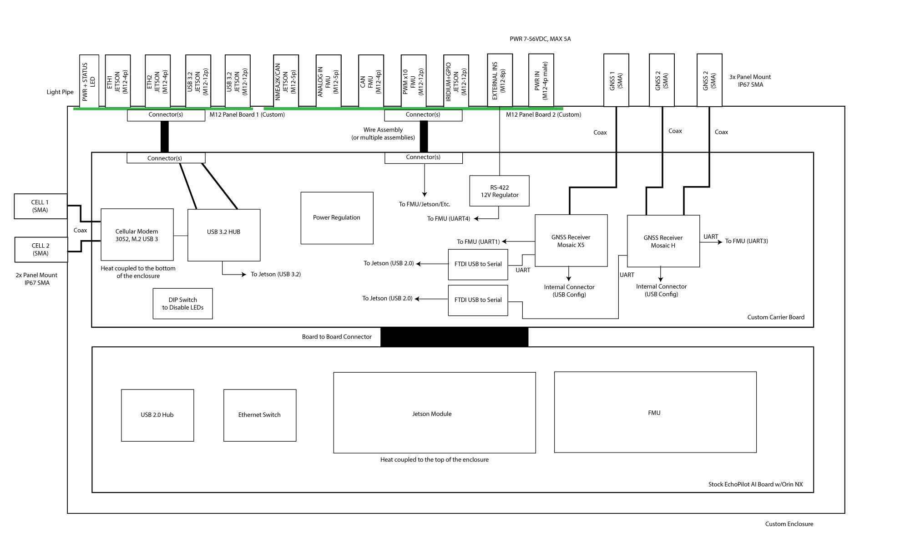
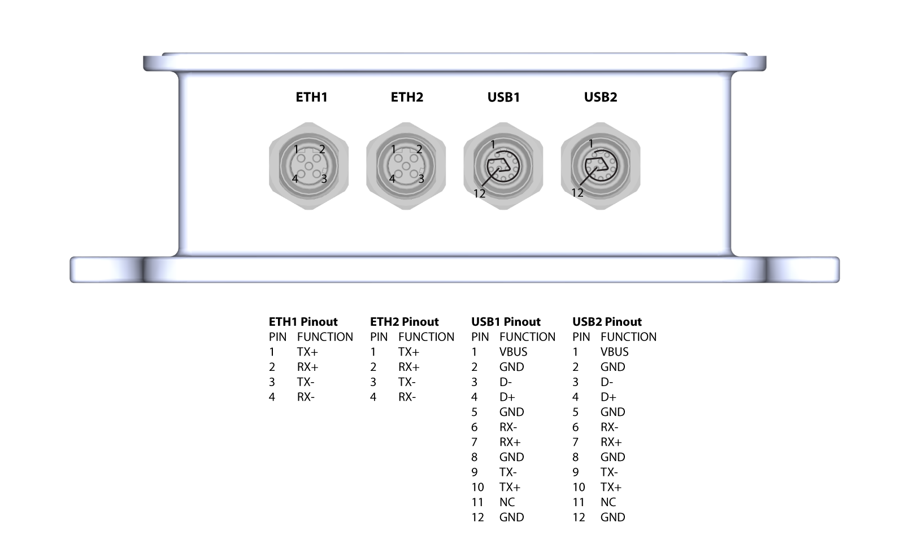
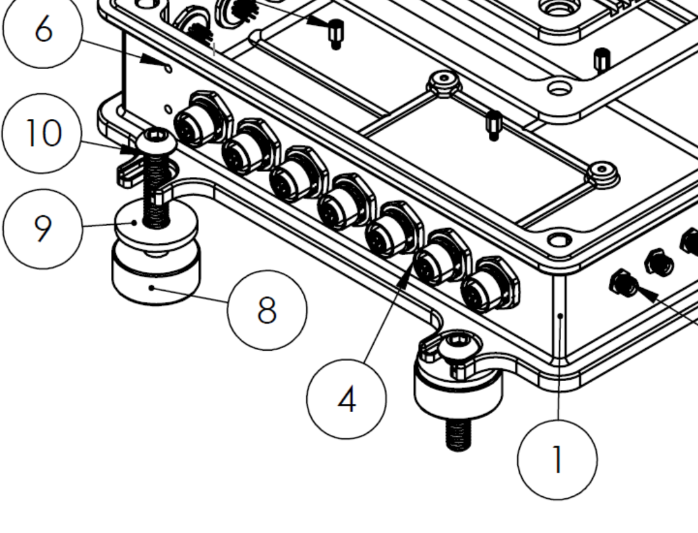

# Donington Documentation

## Overview

The Donington product offers andvanced capabilities for unmanned systems (PX4 and Ardupilot compatiable autopilot) combined with embedded computer power (Jetson Orin) and dual/redundant Septentrio H and X5 GNSS systems. The system is packaged in a robust aluminum case which has been designed to IP67 standards. The Donington product is based on the EchoMAV [EchoPilot AI](https://echomav.com/product/echopilot-ai/), please refer to the [EchoPilot AI Documentation](https://echomav.github.io/docs/latest/echopilot_ai/) for information specific to that device.

## System Diagram/Flowchart



## Setup and Configuration

From the factory, the autopilot system of each Donington system is provisioned with ArduRover(Boat) (latest stable release), and the Jetson is flashed with Jetson L4T 35.4.1 (or later). Minimal open-source [software](https://github.com/EchoMAV/echopilot_deploy) is installed on the Jetson module as described below.

- Cockpit

    [Cockpit](https://cockpit-project.org/) provides a web-based user interface which allows the user remote access into the system using any web browser. The access the system, from a host computer on the same network, browse to `https://IP_ADDRESS` where IP_ADDRESS is the IP Address of the Donington system (see system label). Once logged into the web UI, there are many features including service monitoring, system settings and a web-based terminal.

- Mavlink-router

    [Mavlink-router](https://github.com/EchoMAV/mavlink-router) is an open source tool used to receive telemetry from the autopilot via a serial port and stream it to an IP endpoint (10.223.1.10:14550 over UDP by default). This software is open source and you are free to review the [installation scripts](https://github.com/EchoMAV/echopilot_deploy) or reinstall/remove the software. 

    Default telemetry will stream to `10.223.1.10:14550` using UDP (client mode). This will allow automatic connection to common Ground Control Stations including QGroundControl and Mission Planner. For this to work, your host computer must be set to `10.223.1.10` and the EchoPilot AI must have a [network connection](#configure-the-network) between one of the Ethenret ports and the host computer. Once you get this basic telemetry set up working, then we suggest moving to your final desired telemetry configuration.

    The Cockpit web application has been set up to allow basic configuration changes to Mavlink-router including connection mode, endpoint IP and Port and the input serial port connected to the autopilot system. While we believe this will be sufficient for the majority of applications, Mavlink-router can be configured with much more complicated scenarios, in which case we recommend NOT using the webUI and rather editing `etc\mavlink-router\main.conf` directly. 


### Accessing the Jetson console

!!! WARNING

    Do not run the Jetson SOM without a heat sink. The lid of the Donington system is the primary heat sink, and running the Jetson with the lid off may result in shut down or throttling. If you need to run the system for a continued period of time with the lid removed, position a fan to move air over the heatspreader installed to the Jetson module.

1. Open the lid of the Donington system, to expose the inner electronics. 

!!! note

    A thermal pad is positioned bewtween a heat spreader on the Jetson and the Donington system lid. Please ensure this is in position and undamaged after removing and replacing the lid.

2. Attached a USB cable between your host computer and J15 (Console) on the EchoPilot AI Board

3. In step 2, your host computer should have enumerated a virtual comm port. You will now need to find the name of the port.
!!! info
    **On Windows:** Open Device Manager (Start → Control Panel → Hardware and Sound → Device Manager) Look in the Device Manager list, open the category "Ports", and note the COM port added **USB Serial Port (COM?)** (e.g., COM10).  
    **On Linux:** Run ```dmesg -w``` and then plug in unplug and replug in the USB cable. You should see the name of the device added, typically ```FTDI USB Serial device converter now attached to ttyUSB?``` (e.g., ttyUSB0). 
Use a terminal program to connect to the Jetson's console at 115200 baud, 8N1. 
!!! info
    **On Windows:** We recommend [Putty](https://www.putty.org/) or [TeraTerm](https://osdn.net/projects/ttssh2/releases/).  
    **On Linux:** We recommend Picocom. Install with ```sudo apt-get install picocom```. Use with ```picocom /dev/ttyUSB? -b 115200```. To exit picocom, use ```Ctrl-a Ctrl-x```.
Power the Donington System 13-36VDC source capable of supplying up to **4A**.
!!! warning
    If using a bench supply with over-current protection, we recommend turning it **OFF**. The boot process requires short bursts of high current and over-current protection on some supplies will result in a failed boot. In most cases, if the Jetson fails to boot it is due to a poor power supply.
You should now see the boot messages in your console, and once boot is complete, you will see a login prompt.
!!! note
    The default username is **echopilot** and the default password is **echopilot**
!!! success
    At this point you are logged into the Jetson.

### Accessing the Jetson via network

The Donington system has two 100Mbps Ethernet ports (ETH1 and ETH2). Upstream, these go to a network switch, so either one can be used to access the Jetson SOM. An M12 to RJ45 cable is required (e.g. [ASI-M12-RJ45-11101](https://www.digikey.com/en/products/detail/asi-ez/ASI-M12-RJ45-11101/14008395?s=N4IgTCBcDaIIIGUCSBaAsgRjCgSgKQBYBWFDMgBgwB0AXEAXQF8g))

EchoMAV's standard provisioning sets the Jetson module to a static IP address provided on the label with the device. There is also an alias ip of 192.168.253.0 which can be used if you do not know the static IP. 

To gain console access to the Jetson, use `ssh` from a terminal session on the host computer:

```
ssh echopilot@IP_ADDRESS    #IP_ADDRESS obtained from the label on the device
```
!!! note
    The default password is **echopilot**

### Configuring for DHCP

If you wish to use [DHCP](https://en.wikipedia.org/wiki/Dynamic_Host_Configuration_Protocol), follow the instructions below:

First [gain console access](#accessing-the-jetson-console) via the USB connector. Once logged in via the console, modify the existing static connection (e.g. "static-eth0") to be DHCP:
```
sudo nmcli con mod static-eth0 ipv4.method auto
sudo nmcli con mod static-eth0 ipv4.gateway ""
sudo nmcli con mod static-eth0 ipv4.address ""
sudo nmcli con down static-eth0
sudo nmcli con up static-eth0
```
If the network connection is plugged into a DHCP server, the system will now get an IP address. You can confirm with: 
```
ip addr
```

### Connecting to the FMU via the USB connector

1. Attach a USB cable between the host computer and the **FMU USB** connector (J7).
2. Start a Ground Control application on the host computer such as [QGroundControl](https://docs.qgroundcontrol.com/master/en/getting_started/download_and_install.html) or [Mission Planner](https://ardupilot.org/planner/docs/mission-planner-installation.html).
!!! info
    **QGroundControl:** Will automatically connect.  
    **Mission Planner:** Select the appropriate COM port at the top right, 115200, then click CONNECT.

### Default Autopilot Configuration

By default, the Donington system will come from the factory with ArduRover(Boat) installed and bench tested. The hardware is compatible with other variants of ArduPilot (e.g. Plane, Sub, etc.) as well as the PX4 autopilot project. Instructions for how to flash other versions of firmware can be found at the links below:

- [Flashing ArduPilot](https://echomav.github.io/docs/latest/build_ardupilot/)
- [Flashing PX4](https://echomav.github.io/docs/latest/build_px4/)

### Default Jetson Software
#### IP Configuration
#### Telemetry Routing

### Obtaining Autopilot Data

### GNSS Configuration

## Mechanical Drawings and STEP Files


## Carrier Board Schematic

The Donigton Carrier Board Schematic is [available to download.](assets/schematic.pdf) 

## Pinouts and Connectors

The PWR LED on the left side indicates that the system is powered and running. The STATUS LED is an RGB output indicating the status of the autopilot. Please refer to the autopilot firmware documentation for the meaning of the STATUS LED, e.g. [ArduRover RGB LED documenation](https://ardupilot.org/rover/docs/common-leds-pixhawk.html#rgb-leds). Both LEDs can be deactivated by changing the position of a DIP switch located inside the case. 


<center>

Connector   | Pins | Type | Part Number | Mating Cable Assembly | Notes
------------ | ------------- | ------------- | ------------- | ------------- | ------------- 
PWR       | 4 | M12, A-Code Male  | T4140012041-000  | Tensility 10-03805 |  13-36VDC, 4A + supply        
PWM       | 12 | M12, A-Code Female | T4141012121-000  | Custom |          
INS       | 8 | M12, A-Code Female | T4141012081-000  | Custom |  
IRIDIUM   | 12 | M12, A-Code Female    | T4141012121-000 | Custom | 
FMU CAN   | 4 | M12, A-Code Female  | T4141012041-000 | Custom | 
NMEA2K    | 5 | M12, A-Code Female   | T4141012051-000  | Custom |   
ANALOG IN | 5 | M12, D-Code Female   | T4141512051-000     | Custom |  

</center>



<center>

Connector   | Pins | Type | Part Number | Mating Cable Assembly | Notes
------------ | ------------- | ------------- | ------------- | ------------- | ------------- 
ETH       | 4 | M12, D-Code Male  |  T4141512041-000  | ASI-M12-RJ45-11101 |  100 Mbps Ethernet to Jetson      
ETH       | 4 | M12, D-Code Female | T4141512041-000 | ASI-M12-RJ45-11101 | 100 Mbps Ethernet to Jetson             
USB       | 12 | M12, A-Code Female | T4141012121-000  | Custom | USB 3 SS to Jetson    
USB       | 12 | M12, A-Code Female    | T4141012121-000 | Custom | USB 3 SS to Jetson

</center>


<center>

Connector   | Type | Part Number  | Notes
------------ | ------------- | ------------- | ------------- 
H-1       | SMA  | CABLE 385 RF-150-A-2   |  Mosaic H, Channel 1      
H-2    | SMA | CABLE 385 RF-150-A-2  |  Mosaic H, Channel 2 
X5       | SMA | CABLE 385 RF-150-A-2  |  Mosaic X5   
CELL1   | SMA    | CABLE 385 RF-150-A-2 | Cellular 1          
CELL2   | SMA | CABLE 385 RF-150-A-2 |  Cellular 2

</center>

## Installation and Use

### Vibration Isolation

When used in high-g or high-vibration environments, we recommend the use of vibration-damping mounts, consisting of McMaster Carr parts [93849A202](https://www.mcmaster.com/catalog/130/3678/93849A202) (washer) and [60525K21](https://www.mcmaster.com/catalog/130/1691/60525K21) (vibration-damping mount). Please refer to the image below for installation.



### Cellular Modem Installation


