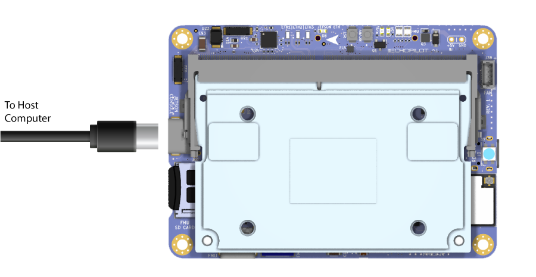
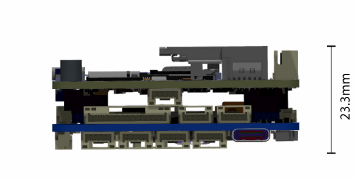
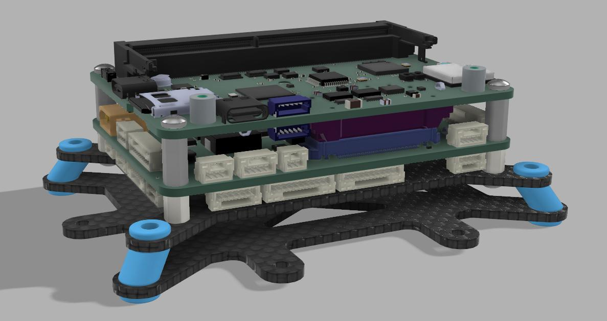

# EchoPilot AI Documentation

## Overview

The EchoPilot AI is a highly integrated vehicle control and edge computing system designed to power next-generation uncrewed systems. The EchoPilot AI supports computer vision, machine learning, autonomy, artificial intelligence and other advanced edge computing needs. The EchoPilot AI implements a STM32H7-based autopilot compatible with the popular Ardupilot and PX4 projects, and uses Pixhawk [open-hardware connectivity standards](https://github.com/pixhawk/Pixhawk-Standards/blob/master/DS-009%20Pixhawk%20Connector%20Standard.pdf). 

The power of  an advanced autopilot is seamlessly combined with high-performance computing (including AI and machine learning), IP networking, cloud connectivity and flexible low-latency hardware accelerated video encoding.


Autopilot Sensors

Function   | Part Number
------------ | ------------- 
IMU 1        | ICM42688P            
IMU 2        | ICM42688P            
IMU 3        | ICM42688P      
Barometer 1        | ICP-20100                  
Barometer 2        | ICP-20100 
Magnetometer        | PNI RM3100    
Add-On INS      | Standalone modules only via RS-232        

The hardware is configured into a two board stack. The upper board is the EchoPilot AI board, and it contains the flight management unit, peripherals, sensors and Nvidia Jetson interface. The lower board is the Carrier Board, and it handles power regulation and provides connector breakouts and additional peripheral connectivity (e.g. support for a Cellular modem). Two high-density FX23L-80S-0.5SV 80-pin board-to-board connectors are used between the two boards. There is 10mm between boards.

This design philosophy achieves multiple goals :

1. For integrated vehicle solutions, it is often desired to design a custom carrier board to add additional components, minimize cables/wiring and integrate power distribution. The EchoPilot AI's design allows you to optionally design a custom carrier board (using the provided Carrier Board as a [reference design](https://github.com/EchoMAV/echopilot_ai_carrier)).
2. A stacked solution minimizes X-Y size in exchange for moving into the Z axis, which is an acceptable compromise for most uncrewed vehicles.
3. Moving the switching power regulators to the Carrier board reduces noise near the sensitive sensors on EchoPilot AI board and reduces the thermal load of the EchoPilot AI mainboard.
4. A stacked design is more future proof, as peripherals can often be added to the Carrier Board without a re-design of the EchoPilot AI main board.

## Quick Start Guide

### Accessing the Jetson via the console

If you included a Jetson SOM in your purchase, it will have been flashed and tested at the factory. If you have a new Jetson module that is not flashed, please see [XavierNX](compile_l4t.md),  [Orinx NX and Orin Nano](compile_l4t_orin.md), and [Nano](compile_l4t_nano.md) instructions.

!!! WARNING

    Do not run the Jetson SOM without a heat sink. The module may be damaged or the performance throttled. EchoMAV offers a variety of heat sink solutions for the Jetson modules, See [EchoPilot AI Accessories](https://echomav.com/product-category/echopilot-ai-accessories/heatsinks/) for recommended active and passive heat sinks. Other solutions are available from a variety of third party manufacturers. 

1. Assemble the EchoPilot AI board with a Carrier Board, using 10mm standoffs between the two boards.
2. If a Jetson Module is not already installed in the EchoPilot AI, install the module now by sliding the Jetson in at a 45 degree angle, then pressing down until in snaps in place. Use Qty 2 M.2 x 6mm screws to secure the Jetson module.
3. Attached a USB cable between your host computer and J15 (Console) on the EchoPilot AI Board

4. In step 3, your host computer should have enumerated a virtual comm port. You will now need to find the name of the port.
!!! info
    **On Windows:** Open Device Manager (Start → Control Panel → Hardware and Sound → Device Manager) Look in the Device Manager list, open the category "Ports", and note the COM port added **USB Serial Port (COM?)** (e.g., COM10).  
    **On Linux:** Run ```dmesg -w``` and then plug in unplug and replug in the USB cable. You should see the name of the device added, typically ```FTDI USB Serial device converter now attached to ttyUSB?``` (e.g., ttyUSB0). 
Use a terminal program to connect to the Jetson's console at 115200 baud, 8N1. 
!!! info
    **On Windows:** We recommend [Putty](https://www.putty.org/) or [TeraTerm](https://osdn.net/projects/ttssh2/releases/).  
    **On Linux:** We recommend Picocom. Install with ```sudo apt-get install picocom```. Use with ```picocom /dev/ttyUSB? -b 115200```. To exit picocom, use ```Ctrl-a Ctrl-x```.
Power the Carrier Board with 7-56VDC source capable of supplying up to **4A**.
!!! warning
    If using a bench supply with over-current protection, we recommend turning it **OFF**. The boot process requires short bursts of high current and over-current protection on some supplies will result in a failed boot. In most cases, if the Jetson fails to boot it is due to a poor power supply.
You should now see the boot messages in your console, and once boot is complete, you will see a login prompt.
!!! note
    The default username is **echopilot** and the default password is **echopilot**
!!! success
    At this point you are logged into the Jetson and can begin [configuring the network](#configure-the-network), installing applications, etc.
 
### Connecting to the FMU via the USB connector

1. Attach a USB cable between the host computer and the **FMU USB** connector (J7).
2. Start a ground control application on the host computer such as [QGroundControl](https://docs.qgroundcontrol.com/master/en/getting_started/download_and_install.html) or [Mission Planner](https://ardupilot.org/planner/docs/mission-planner-installation.html).
!!! info
    **QGroundControl:** Will automatically connect.  
    **Mission Planner:** Select the appropriate COM port at the top right, 115200, then click CONNECT.

### Streaming telemetry over the network

EchoMAV provisions Jetson modules at the factory to be set to a static IP address, and a few default software applications are installed including [mavlink-router](https://github.com/EchoMAV/mavlink-router) and a web-based user interface. [mavlink-router](https://github.com/EchoMAV/mavlink-router) is an open source tool used to receive telemetry from the autopilot via a serial port and stream it to an IP endpoint (10.223.1.10:14550 over UDP by default). This software installation is open source and you are free to review the installation scripts or reinstall the  software using the instructions [here](https://github.com/EchoMAV/echopilot_deploy). The instructions below assume the Jetson module installed in your EchoPilot AI hardware has been provisioned using our software installation and static IP configuration.

Default telemetry will stream to `10.223.1.10:14550` using UDP (client mode). This will allow automatic connection to common Ground Control Stations including QGroundControl and Mission Planner. For this to work, your host computer must be set to `10.223.1.10` and the EchoPilot AI must have a [network connection](#configure-the-network) between one of the Ethenret ports and the host computer

The telemetry endpoint can be easily changed by using the web UI at https://{IP_ADDRESS} (the recommendeded way), or more advanced users can use the command line by first [gaining console access](#accessing-the-jetson-via-the-console) and then editing `\etc\mavlink-router\main.conf`. For example:

```
[UdpEndpoint alpha]
Mode = Normal
Address = 10.223.1.10  #change to target IP address
Port = 14550
```
Then restart the mavlink-router service (or reboot)
```
sudo systemctl restart mavlink-router
```

## EchoPilot IP Addressing

__The EchoPilot AI will be labeled from the factory with a static IP address in the 10.223.0.0/16 subnet such as 10.223.134.126 (for example). If you do not know the IP address, you may be able to access the system using the backdoor/alias IP of 192.168.154.0/24__. 

Using EchoMAV's software stack, the system's static IP address is calculated using the last two octets of the Jetson's `eth0` interface MAC address with a netmask of 255.255.0.0 (/16). For example, given the MAC address of 00:30:1A:4E:A4:3E, the last two octets 0xA4 and 0x3E are onverted from hex to decimal and then assigned as the last two octets of the IP address. In this example, this MAC address would correspond to 10.223.164.62/16 because 0xA4 = 164 and 0x3E = 62. This IP address is printed on the label from the factory.

To access the Jetson module using IP, first set up your host computer to have a static IP address in the 10.223.0.0/16 subnet with any IP address OTHER than the address of the EchoPilot AI.
!!! info
    **On Windows:** Open Device Manager (Windows Key + X → Press "W" → Click on "Change adapter options" → Right click, properties of the adapter connected to the EchoPilot AI → Highlight "Internet Protocol Version 4 (TCP/IPv4) and click __Properties__ ). Select "Use the following IP address" and configure the IP address and Subnet mask. Then click __OK__ → __Close__.  

    

    **On Linux:**
    Find the wired interface name, most typically this can be found using
    ```
    $ ip ad
    enp43s0: <NO-CARRIER,BROADCAST,MULTICAST,UP> mtu 1500 qdisc fq_codel state DOWN group default qlen 1000
    link/ether 34:73:5a:e8:57:3f brd ff:ff:ff:ff:ff:ff

    ```
    In the response above, the interface name is `enp43s0`. Use `nmcli` and the interface name found above set a static IP address (e.g. 10.223.1.10/16): 
    ```
    $ nmcli con add con-name "static-eth" ifname enp43s0 type ethernet ip4 10.223.1.10/16
    $ nmcli con up "static-eth"
    ```
    Now take down the other connections, for example a connection `ens32` is shown below:
    ```
    $ nmcli con show
    NAME         UUID                 TYPE           DEVICE
    enp43s0      ff9804db5-........   802-3-ethernet --
    static-eth   a4b59cb4a-........   802-3-ethernet ens32

    $ nmcli con down enp43s0
    ```
    Note that your device will likely lose internet access unless you happen to have a gateway on 10.223.x.x/16 subnet. To restore your default connection, use `nmcli` to take down the static connection and restore the original. For example:
    ```
    $ nmcli con down static-eth
    $ nmcli con up enp43s0
    ```
!!! note
    If you do not know the IP address of your system, you can use the configuration IP "backdoor" alias of __192.168.154.0/24__ to access the system. Ensure your host system is in the 192.168.0.0/24 subnet (any valid IP address __not equal__ to 192.168.154.0 will work). Please refer to the instructions above for how to change your host IP address.


## Board Components and Connectors

### EchoPilot AI Mainboard


### Carrier Board


### Pinouts

For EchoPilot AI Mainboard Pinouts, refer to the [EchoPilot AI Pinout Page](echopilot_ai_pinout.md).  

For Standard Carrier Board Pinouts, refer to the [Carrier Board Pinout Page](echopilot_carrier_pinout.md).

## Jetson IO Availability

The following Jetson IO pins are brought out to the B2B connector J5 and are available for customer use:
!!! note
    *Changes to the direction and functionality of these pins may be possible based on the Jetson pinmux configuration.

Jetson Pin   | Direction     | B2B (J5)      | Voltage   | Default Use  |  GPIO (Xavier) | GPIO (Orin NX Orin Nano)
------------ | ------------- | ------------  | ------------ | ------------ | ------------ | ------------
PIN 218        | IO     |  73     | +3.3V*     | Iridium Ring         | GPIO3_PCC.04  | GPIO3_PN.01
PIN 240         | IO    |  39     | +1.8V       | SLEEP/WAKE        |   GPIO3_PEE.04 | GPIO3_PEE.04          
PIN 178         | IO    |  38     | +1.8V       | nMOD_SLEEP        |   NA | NA
PIN 197         | IO    |  40       | +1.8V       | I2S0_FS           | GPIO3_PU.00 | GPIO3_PI.02
PIN 124        | IO     |  79     | +1.8V     | GPIO O2        | GPIO3_PQ.03  | GPIO3_PP.06
PIN 195        | IO     |  37     | +1.8V     | IS20_DIN        | GPIO3_PT.07  | GPIO3_PI.01
PIN 199        | IO     |  76     | +1.8V     | IS20_SCLK        | GPIO3_PT.05  | GPIO3_PH.07

!!! note
    *Pin 218 (Iridium Ring) is level-shifted from 1.8V to 3.3V prior to the B2B (J5) connector via a TXS0108ERGYR level translator.

The following Jetson IO is used internally by the EchoPilot AI:
!!! warning
    *Changes to the pinmux affecting these pins may break functionality.

Jetson Pin   | Direction   | Voltage | Use | Pin Description (Xavier) | Pin Description (Nano)
------------ | ------------- | ------------ | ------------  | ------------ | ------------
PIN 87         | I       | +1.8V       | Vbus Detect      | USB_VBUS_EN0   | USB_VBUS_EN0
PIN 130        | O         | +1.8V    | Camera Mux       |  GPIO3_PCC.03    | GPIO3_PI.00
PIN 212        | I         | +1.8V    | M2 Alert       |   GPIO3_PQ.01   | GPIO3_PV.01


The following Jetson IO pins are brought out to the FAN (J38) connector:

Jetson Pin   | Direction     | Voltage      | Use         | Pin Description (Xavier) | Pin Description (Nano)
------------ | ------------- | ------------ | ------------| ------------  | ------------
PIN 230        | O         |  +5V  | Fan PWM   |  GPIO3_PH.01       | GPIO3_PE.07
PIN 208        | I         |  +5V  | Fan Tachometer  |   GPIO3_PQ.02     | GPIO3_PZ.02


## Mechanical Drawings and STEP Files


<figure markdown>
  { width="600" }
  <figcaption>With Carrier Board Attached</figcaption>
</figure>

<figure markdown>
  { width="600" }
  <figcaption>EchoPilot AI without a Carrier Board Attached</figcaption>
</figure>

[EchoPilot AI 3D Model (STEP) File Download](https://echomav.com/mechanical/echopilot_ai_r1a.step) (right click, save link as)

[EchoPilot AI Universal Carrier Board 3D model (STEP) File Download](https://echomav.com/mechanical/echopilot_ai_carrier_r1.step) (right click, save link as)

[EchoPilot AI PWM Breakout Board 3D model (STEP) File Download](https://echomav.com/mechanical/echopilot_pwm_breakout.step) (right click, save link as)

[EchoPilot AI USB3 A Breakout Board 3D model (STEP) File Download](https://echomav.com/mechanical/echopilot-ai-usb-a-breakout.step) (right click, save link as)

## Vibration Isolation

Many commercial autopilots use foam vibration isolation on a daughterboard containing the IMUs. You'll notice the EchoPilot AI does not use this type of design and the IMUs are mounted directly to the circuit board. The reason for this is that we feel better vibration isolation can be achieved (if required) by leveraging the mass of the entire EchoPilot system (carrier board, main board and Jetson SOM) rather than the very small mass of an IMU daughterboard. For the types of vibrations encountered by large-prop multi-rotors and piston-based engines (50-90 Hz), the total mass of the EchoPilot system mounted on vibration silicone isolators or wire rope isolators are very effective. This design has the added benefits of protecting critical electronics from exposure to continuous vibrations.  

An example of a typical vibration isolation mount is shown below:

<figure markdown>
  { width="600" }
  <figcaption>EchoPilot AI Vibration Mount</figcaption>
</figure>

!!! note
    Note that for small and medium multi-rotors and electric planes, electric quadplanes and other vehicle types, vibration isolation is very rarely needed. 

## Using an NVMe SSD

The EchoPilot AI includes an M.2 Key-M slot for a size 2230 NVMe SSD. We recommend a PCIe Gen. 4 NVMe SSD, such as the Western Digital SN740 (SDDPTQD-1T00), Western Digital Industrial Series (SDBPTPZ-1T00-XI) or Kingston OM3PGP41024P-A0 for applications in the 0-70°C range. Please be aware that most consumer NVMe SSDs have a commercial temperature rating (0-70°C). We recommend industrial rated devices for high-risk or high-valued use in uncrewed systems.

The NVMe is power by a dedicated supply, 3A. 

To add an NVMe SSD to an EchoPilot system, first power off the system and install the SSD using a M2x3mm wafer head screw. 

<figure markdown>
  { width="600" }
  <figcaption>Install the 2230 NVMe drive and secure with an M2x3 wafer head screw</figcaption>
</figure>

Power on the sytem and [gain console access](#accessing-the-jetson-via-the-console).

Identify the NVMe SSD using:  
```
sudo fdisk -l
```

Create a partiaion table using:  
```
sudo parted /dev/nvme0n1 mklabel gpt
```

Create a new partition on the NVMe SSD:  
```
sudo parted -a optimal /dev/nvme0n1 mkpart primary ext4 0% 100%
```

Format the newly created partition:  
```
sudo mkfs.ext4 /dev/nvme0n1p
```

Create a mount point directory:  
```
sudo mkdir /mnt/nvme
```

Mount the NVMe SSD partition to the mount point directory:  
```
sudo mount /dev/nvme0n1p1 /mnt/nvme
```

Verify the NVMe SSD is mounted correctly by checking the file system:  
```
df -h
```

## Unique Board Identifier

Each EchoPilot AI includes an AT24CS01-STUM unique ID EEPROM attached to the Jetson I2C 1 port at address 0x58. This can be used to obtain a unique 128-bit identifier (serial number) for your board. 

Below is an example python script you can use to read this serial number.

First install python3 wih smbus
```
sudo apt-get install python3-smbus
```
Create a new file ```serial.py``` with these contents:
```
import smbus
import sys

# usage, pass the i2c bus as the first argument, e.g. python3 serial_number 0

i2c_ch = int(sys.argv[1]) 

# address on the I2C bus
i2c_address = 0x58

# Register address
serial_num = 0x80

# Read serial number register
def read_serial():

    # Read the serial register, a 16 byte block
    val = bus.read_i2c_block_data(i2c_address, serial_num, 16)    
    return val

# Initialize I2C (SMBus)
bus = smbus.SMBus(i2c_ch)

try:
    # Print out the serial number
    print(bytes(read_serial()).hex())

except:
    pass
```
You can then run the script using below, where the argument is the system's i2c bus. This may vary from different Jetson modules, but will most often by 0 or 1.
```
sudo python3 serial.py 0
```

## Configure the Network

The EchoPilot AI has two 100Mbps Ethernet ports (ETH1 and ETH2). Upstream, these go to a network switch, so either one can be used to access the Jetson SOM. To interface using a standard RJ45 cable, use the included Ethernet adapter board and cable assembly connected as shown below. The make your own cable assembly, refer to the [Pinout](echopilot_carrier_pinout.md#ethernet-1-j15)

<figure markdown>
  { width="900" }
  <figcaption>To connect a standard RJ45 network cable, use the adapter as shown</figcaption>
</figure>

EchoMAV's standard provisioning sets the Jetson module to a static IP address provided on the label with the device. There is also an alias ip of 192.168.253.0 which can be used if you do not know the static IP. 

### Configuring for DHCP

If you wish to use [DHCP](https://en.wikipedia.org/wiki/Dynamic_Host_Configuration_Protocol), follow the instructions below:

First [gain console access](#accessing-the-jetson-via-the-console) via the USB connector. Once logged in via the console, modify the existing static connection (e.g. "static-eth0") to be DHCP:
```
sudo nmcli con mod static-eth0 ipv4.method auto
sudo nmcli con mod static-eth0 ipv4.gateway ""
sudo nmcli con mod static-eth0 ipv4.address ""
sudo nmcli con down static-eth0
sudo nmcli con up static-eth0
```
If the network connection is plugged into a DHCP server, the system will now get an IP address. You can confirm with: 
```
ip addr
```

### Configuring a Static IP Address

If you do not have a DHCP server, or you wish to assign a static IP address to the Jetson, follow the instructions below.

First [gain console access](#accessing-the-jetson-via-the-console) via the USB connector. Once logged in via the console, delete the default connection, for example "Wired connection 1":
```
sudo nmcli c delete "Wired connection 1"
```
Set up a static connection called `static-eth0` with an IP of 10.223.1.10, a netmask of 255.255.0.0 and a gateway of 10.223.1.1. The values are just examples, please adjust to the desired settings for your network.
``` 
sudo nmcli c add con-name static-eth0 ifname eth0 type ethernet ip4 10.223.1.10/16 gw4 10.223.1.1
```
Bring up the new interface
```
sudo nmcli c up static-eth0
```
To verify network connectivity, ping another device on the network, or to verify internet connectivity, ping a Google DNS server:
```
ping 8.8.8.8
```

### Other NetworkManager tips and tricks
Linux for Tegra uses networkmanager (`nmcli`) for its network interfaces. Below you will find a few commands for common network tasks. These examples are not intended for you to follow sequentially, these are common examples which will demonstrate most network configuration needs.

Show connections:    
```nmcli con show```

Example: Delete the default connection ("Wired connection 1") and set up a static connection called `static-eth0` with an IP of 172.20.1.100, a netmask of 255.255.0.0 and a gateway of 172.20.2.100:    
```
sudo nmcli c delete "Wired connection 1"
sudo nmcli c add con-name static-eth0 ifname eth0 type ethernet ip4 172.20.1.20/16 gw4 172.20.2.100
sudo nmcli c up static-eth0
```

Example: Change IP address of `static-eth0` connection to `192.168.1.4` with a 255.255.0.0 (/16) netmask:    
```
sudo nmcli con mod static-eth0 ipv4.address 192.168.1.1/16
```

Example: Change the gateway of `static-eth0` connection to `192.168.1.1`:    
```
sudo nmcli con mod static-eth0 ipv4.gateway 192.168.1.1
```

Example: Change the DNS of `static-eth0` connection to `8.8.8.8`:       
```
sudo nmcli con mod static-eth0 ipv4.dns "8.8.8.8"
```

Example: Take down/up of `static-eth0`:      
```
sudo nmcli con down static-eth0
sudo nmcli con up static-eth0
```
Example: Delete the `static-eth0` connection:    
```
sudo nmcli c delete "static-eth0"
```

Example: Add a new connection called `static-eth0` with IP `172.20.2.22/16` and gateway `172.20.2.100` on interface `eth0`:    
```
sudo nmcli c add con-name static-eth0 ifname eth0 type ethernet ip4 172.20.2.22/16 gw4 172.20.2.100
```

Example: Add a persistent route so that multicast traffic to 224.x.x.x goes to the `static-eth0` connection:  
```
sudo nmcli con mod static-eth0 +ipv4.routes "224.0.0.0/8"
```

Example: Change the static-eth0 connection to remove static IP and enable DHCP (In this case, it would be clearer to delete the connection since it is named `static-eth0` and call it something else, but for edification:
```
sudo nmcli con mod static-eth0 ipv4.address ""
sudo nmcli con mod static-eth0 ipv4.gateway ""
sudo nmcli con mod static-eth0 ipv4.method auto
sudo nmcli con reload static-eth0
```

## Adding WiFi to the EchoPilotAI

The instructions below provide details on how to get WiFi working using a [TP-Link AC1300 (Archer T3U)](https://a.co/d/bUNSOTD) wireless network adapter. These instructions were developed using Jetpack 35.4.1, running Linux Kernel 5.10. If you are usinng a newer version, you will need a different branch for the driver install. Please refer to the driver's [readme](https://github.com/fastoe/RTL8812BU/blob/master/README.md).

Connect the AC1300 to one of the USB3 connectors (J24 or J29 on the carrier board) using the provided cable and USB-A breakout board. 

### Clone and install the RTL8812BU driver

```
cd /tmp
sudo apt update
sudo apt update
sudo apt install -y build-essential dkms git bc
git clone -b v5.6.1 https://github.com/fastoe/RTL8812BU.git
cd RTL8812BU
make
sudo make install
sudo reboot
```
### Verify you have a wlan0 device present
```
iwconfig
```
The output of this command should include wlan0, for example:
```
lo        no wireless extensions.
dummy0    no wireless extensions.
eth0      no wireless extensions.
l4tbr0    no wireless extensions.
rndis0    no wireless extensions.
usb0      no wireless extensions.
wlan0     IEEE 802.11AC  ESSID:"EchoMAV"  Nickname:"<WIFI@REALTEK>"
          Mode:Managed  Frequency:5.24 GHz  Access Point: C8:9E:43:D5:C0:9C
          Bit Rate:867 Mb/s   Sensitivity:0/0
          Retry:off   RTS thr:off   Fragment thr:off
          Power Management:off
          Link Quality=72/100  Signal level=65/100  Noise level=0/100
          Rx invalid nwid:0  Rx invalid crypt:0  Rx invalid frag:0
          Tx excessive retries:0  Invalid misc:0   Missed beacon:0
```
### Use nmcli to set up your wireless connection

Replace _SSID_ and _PASSWORD_ below with your network information.
```
sudo nmcli dev wifi connect <SSID> password <PASSWORD>
```
### Verify the connection

Using networkmanager, you should now see a connection NAME matching your WiFi SSID and it should be green indicating the connection is established.
```
nmcli c s
```
At this point, you have a WiFi connection. If your system still has a static network configuration, you may need to deactivate that connection or update your routing to ensure packets are routed over the new WiFi interface. For example, if you have an active static-eth0 interface, it can be deactivated using:
```
sudo nmcli c d static-eth0
```
You should now be routing internet packets via your WiFi connection. To check your connection speed, install and run Ookla's Speedtest tool:
```
sudo apt-get install curl
curl -s https://packagecloud.io/install/repositories/ookla/speedtest-cli/script.deb.sh | sudo bash
sudo apt-get install speedtest
```
Check your download and upload speed:
```
speedtest
```


## Configuring CAN on the Jetson

These instructions are a work in progress and may not be fully correct.  

Modify `/etc/modprobe.d/denylist-mttcan.conf` and ensure the line `blacklist mttcan` is commented out. Reboot, then log in again and run `sudo modprobe mttcan`.

## Streaming Telemetry from the Autopilot (Detailed)

The autopilot has a high-speed serial interface between the FMU/STM32H7 and the Jetson SOM. The Jetson UART1 (pins 203, 205) is connected to the autopilot's UART2. If EchoMAV has provisioned your board, or if you are using our [Board Support Package](https://github.com/EchoMAV/echopilot_ai_bsp), then the default parameters will be set automatically if you build the PX4 or Ardupilot firmware. However, to understand what parameters are used to enable [MAVLink](https://mavlink.io/en/) data flow between the FMU and Jetson, note the parameters used below. In both cases, you are enabling the autopilot serial port to receive MAVLink2 data and setting the baud rate to the appropriate value. A typical baud rate is `500000` kpbs, but you can use any baud rate you wish as long as the mavlink-router application sending/receiving MAVLink on the Jetson is configured to match. For factory provisioned devices, we set it to 500000.

For example, on ArduPilot set the following params and reboot:
```
SERIAL2_PROTOCOL: MAVLink2
SERIAL2_BAUD: 500   ## 500,000 kbps
```
For PX4, set the following params and reboot.
```
MAV_1_CONFIG 102: Telem 2  ## Reboot after this change to expose additional parameters
MAV_1_RATE: 0
MAV_1_MODE 2: Onboard
SER_TEL2_BAUD: 500000   ## Reboot after this change

```

On the Jetson side, UART1 is typically enumerated ```/dev/ttyTHS0```, although it could vary with different Jetson modules including ```/dev/ttyTHS1``` and ```/dev/ttyTHS2```.

For using the EchoPilot AI to route MAVLink data over a network, we pre-install and recommend [MAVLink Router](https://github.com/mavlink-router/mavlink-router). For modules configured at the factory, we now provide mavlink-router installed by default and is configured to push telemetry via UDP to `10.223.1.10:14550`

Should you need or want to install this independently, EchoMAV has an open-source installer which makes it easy to install MAVLink Router and configure it as a service which starts at boot. Please refer to the our installer repo [https://github.com/EchoMAV/mavlink-router](https://github.com/EchoMAV/mavlink-router) for instructions. 

If you use the install repo above, please refer to the instructions there for configuration of the UART and destination IP address. Specifically edit `etc\mavlink-router\main.conf` with the appropriate settings.

If you have permission issues accessing `/dev/ttyTHSX`, please disable `nvgetty` and ensure you are a member of the `dialout` group, or just use our [MAVLink Router Installer Repo](https://github.com/EchoMAV/mavlink-router) along with `make install` and a reboot which sets these things up for you. Thes steps to disable `nvgetty` and add your account to the `dialout` group are shown below.
```
sudo systemctl stop nvgetty
sudo systemctl disable nvgetty
sudo usermod -aG dialout $USER
```
!!! note
    Reboot to apply changes.

## FMU Ports

The Flight Manamgenent Unit (FMU) is based on the FMUv5 design, and uses I2C, SPI and UART ports as defined in the table below.

Port | Use | Connector Assignement
------------ | ------------- | ------------ 
USART1 | External (GPS) | Carrier Board J20
USART2 | External/User (Telem1) | Carrier Board J18
USART3 | Telemetry to Jetson (Telem2) | NA (internally routed)
UART4 | External/User (shifted to RS-232) | Carrier Board J32
USART5 | Not Used | NA 
USART6 | Remote ID | NA (internal)
UART7 | External/User (Debug) | EchoPilot J12
UART8 | IO MCU | NA (internal)
SPI1 | ICM42688P #1 and #2 | NA (internal)
SPI2 | RM3100 and FRAM | NA (internal)
SPI3 | Not Used | NA
SPI4 | ICM42688P #3 and MS5611 #1 NA (internal)
SPI5 | Not Used | NA
SPI6 | MS5611 #2 | NA (internal)
I2C1 | GPS/Compass | Carrier Board J20
I2C2 | External/User | Carrier Board J25
I2C3 | Not Used | NA
I2C4 | Not Used | NA

### UART Order

The default UART order for use for autopilot firmware is provided below. For example, SERIAL3 on Ardupilot is mapped to the GPS connector, SERIAL1 to the Telemetry connector, etc. 

Port Name | Function | Port | Connector
------------ | ------------- | ------------ | ------------
SERIAL0 | Console | USB | EchoPilot J7
SERIAL1 | Telem1 | USART2 | Carrier Board J18
SERIAL2 | Telem2 | USART3 | None (internally routed to Jetson)
SERIAL3 | GPS1 | USART1 | Carrier Board J20
SERIAL4 | External INS (RS-232 shifted) | UART4 | Carrier Board J32
SERIAL5 | Onboard Remote ID | USART6 | NA
SERIAL6 | Debug | UART7 | EchoPilot J12

Please reference the [EchoPilot AI's BSP](https://github.com/EchoMAV/echopilot_ai_bsp) firmware-specific board definition files for additional details related to board setup.

## CAN Termination

The 2 CAN connections from the FMU (CAN1 and CAN2) and the 1 from the Jetson are driven by LTC2875 transceivers and contain termination resistors at the drivers. Should you desire to remove these termination resistors (e.g., you want to place the EchoPilot AI in the middle of a CAN chain rather than at the end), refer to the following:  

CAN   | Resistor Label     | Notes      
------------ | ------------- | ------------ 
FMU CAN1       | R19         |  Near U4 and U45, size 0402
FMU CAN2        | R9         |  Near U3, size 0402
JETSON CAN1 | R95         |  Near U32, size 0402  

## Battery Voltage/Current Monitoring

There are a wide variety of commercial voltage/current monitors which are compatiable with the EchoPilot. Examples of how to configure a few of them are provided below. Note that the EchoPilot AI carrier board does NOT include a current sensor because such a sensor needs to be placed directly after the system battery such that it can capture the both the total current output consumed by the motors/ESCs, radios, and other perpiherals in addition to the EchoPilot AI.

### Digital Ouput 

Voltage/Current sensors which provide a digital output internface are commercially available. For example, the [MATEKSYS CAN-L4-B](Mhttps://www.mateksys.com/?portfolio=can-l4-bm) provides voltage sensing up to 85V and current sensing from 0-204.8A and uses the CAN bus. To set up this device use the following parameters:

Parameter   | Value           
------------ | ------------- 
CAN_P1_DRIVER | 1 (if attached to CAN bus1 port or CAN_P2_DRIVER = 1 if attached to CAN bus2 port)
BATTx_MONITOR    | 8

### Analog Input to the FMU (Voltage/Current Sense)

The EchoPilot AI FMU design provides 6 analog inputs to the STM32H743. Often, these are used for voltage/current input for the battery systems onboard an uncrewed system. The Analog input pin mapping for each input is shown below. To use these inputs, change the parameters in ArduPilot or PX4 to the appropriate pins.

Input Name  | Carrier Board Connector | STM32H743 Pin | ArduPilot/PX4 Virtual Pin          
------------ | ------------- | ------------ | ------------
Voltage Sense 1        | J13.2  | PA0  | 16       
Current Sense 1        | J13.3  | PA1  | 17     
Voltage Sense 2 | J13.4   | PA2 | 14
Current Sense 2 | J13.5   | PA3 | 15
Spare ADC 1  | J13.6   | PC4  |  4
Spare ADC 2 | J13.7   | PA4  |  18

#### ArduPilot Setup for Analog Voltage/Current Sense

For example, the [Common Power Module](https://ardupilot.org/copter/docs/common-powermodule-landingpage.html)

Parameter   | Value           
------------ | ------------- 
BATT_MONITOR    | 4
BATT_VOLT_PIN       | 16         
BATT_CURR_PIN        | 17        

If you wish to monitor two battiers, the additional analog inputs (J13.4 and J13.5) can be used with the parameters below: 

Parameter   | Value           
------------ | ------------- 
BATT2_VOLT_PIN | 14         
BATT2_CURR_PIN | 15

The following parameters will need to be adjusted based on the specific Analog Voltage/Current Sensor used:

Parameter   | Value | Notes           
------------ | ------------- | -------------
BATT_AMP_PERVLT    | Dependent on Hardware | The amps per volt scaling factor
BATT_AMP_OFFSET     | Dependent on hardware | The output voltage at zero amps
BATT_VOL_MULT       | Dependent on hardware | The scaling factor between the output voltage of the sensor and the true system voltage

#### PX4 Setup for Analog Voltage/Current

Parameter   | Value           
------------ | ------------- 
BAT1_V_CHANNEL       | 16         
BAT1_I_CHANNEL        | 17        
BAT2_V_CHANNEL | 14         
BAT2_I_CHANNEL | 15

## Remote ID Subsystem

The Remote ID system is based on an ESP32-C3 and is designed to work with the [ArduRemoteID](https://github.com/ArduPilot/ArduRemoteID) project and Open Drone ID standards.

ArduRemoteID is is an implementation of a MAVLink and DroneCAN OpenDroneID transmitter. It aims to provide a transmitter solution for the FAA standard RemoteID requirement, meeting the transmitter component of the ASTM F3586-22 Means of Compliance. It also aims to be compliant with the RemoteID regulation in the EU.

It is the responsibility of the user to configure the ArduRemoteID firmware in a way that it is compliant with the local RemoteID regulation. For instance, in the USA it is mandatory that UAV manufacturers submit a DoC (Declaration of Conformance) to the FAA where they state that their product is compliant with the RemoteID regulation.

To flash ArduRemote ID to the ESPS32-C3, you will need a TC2030-USB-NL cable from [tag-connect.com](https://www.tag-connect.com) and follow the flashing instructions from the [AruRemoteID](https://github.com/ArduPilot/ArduRemoteID#flashing) project.

The ESP32-C3 is connected to the FMU via UART6, aka Telem3 (pins PG9 (RX) and PG14 (TX) from the STM32H742). You will need to configure ArduPilot/PX4 to use this UART for RemoteID.

For building ArduRemoteID for the EchoPilot AI, the following pins will need to be defined for the hardware:
```
#define PIN_UART_TX 4
#define PIN_UART_RX 5
WS2812_LED_PIN GPIO_NUM_8
```
### Firmware for OpenDroneID

Special firmware is required for full integration of a Remote ID transmitter to add a layer of tamper-resistance as required by various countries initiatives. This is achieved by
- Using a special board ID for ODID (OpenDroneID) firmware that will reject normal attempts of loading firmware without the necessary functions and parameters required for compliance. Any bootloader created with OpenDroneID capabilities also has firmware checking enabled such that it will not boot main firmware unless the board ids match.
- Special READONLY parameters which can be set in the firmware during the compilation

As such, if you wish to utilize Remote ID for your application, you will need to commpile firmware yourself or contact support@echomav.com for assistance. Please see the instructions [here](https://ardupilot.org/dev/docs/opendroneid.html#building-firmware-for-bench-testing-and-experimentation) for additional information.
