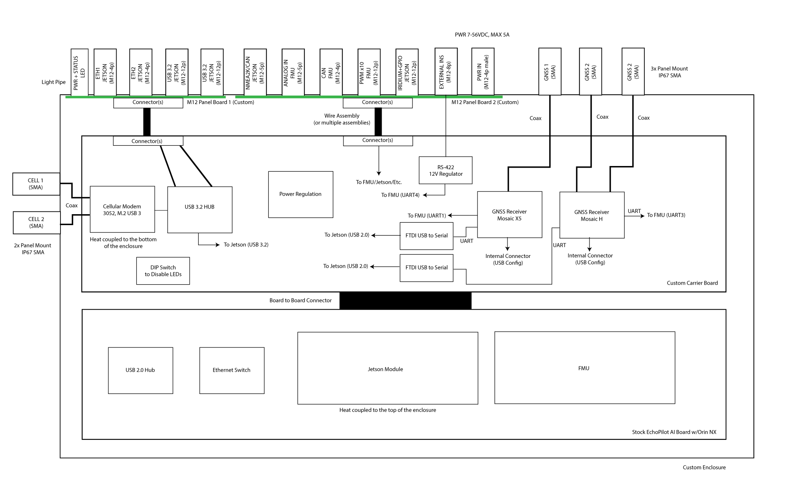
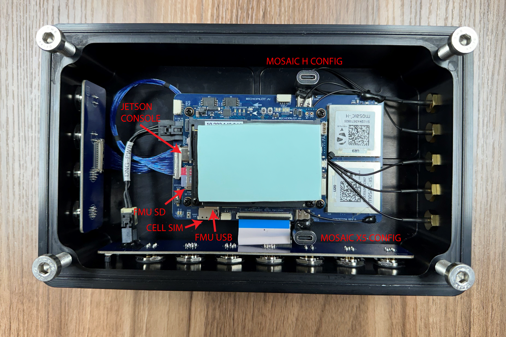

The Donington system uses the EchoMAV [EchoPilot AI](https://echomav.com/product/echopilot-ai/) combined with a customized carrier board.

To fill in gaps not covered in this documentation, please cross reference the [EchoPilot AI Documentation](https://echomav.github.io/docs/latest/echopilot_ai/). 

The flow chart below shows the overall hardware architecture. The custom carrier board described below mates to the EchoPilotAI's board to board connectors, and provided Donington-specific functionality. Specifically, the Donington carrier board provides two Septentrio GNSS units, a RS-422 level shifter for an external INS system, two FTDI serial converters, power subsystems and connectors not found on EchoMAV's standard commercial carrier board. The system also includes a ruggedize aluminum enclosure, passive heat dissipation, IP67-design, and industrial M12 connectors.

## Carrier Board Schematic

The Donington Carrier Board Schematic is [available to download.](assets/schematic.pdf) 

## FMU Ports

The Autopilot system (also referred to as Flight Management Unit (FMU)) is based on the open-hardware Pixhawk design running an STM32H743 microcontroller. The peripherals for this device are connected via I2C, SPI, CAN and UART ports. The table below identifies how each peripheral interfaces is used.

Port | Use | Connector Assignement
------------ | ------------- | ------------ 
USART1 | GPS1 | Mosaic X5 GPS (serial port 1, pins B1/D1)
USART2 | GPS2 | Mosaic H (serial port 1, pins B1/D1)
USART3 | Telemetry to Jetson (Telem2) | NA (internally routed)
UART4 | External INS1 (RS-422 shifted) | External INS connector 
USART5 | Not Used | NA 
USART6 | Remote ID | NA (internal)
UART7 | External/User (Debug) | EchoPilot J12
UART8 | IO MCU | NA (internal)
SPI1 | ICM42688P IMU #1 and #2 | NA (internal)
SPI2 | RM3100 Compass and FRAM | NA (internal)
SPI3 | Not Used | NA
SPI4 | ICM42688P IMU #3 and MS5611 Baro #1 NA (internal)
SPI5 | Not Used | NA
SPI6 | MS5611 Baro #2 | NA (internal)
I2C1 | External RGB LED | 
I2C2 | Internal (Spare) | Carrier Board J13
I2C3 | Not Used | NA
I2C4 | Not Used | NA

## FMU UART Order

The default UART order for use for autopilot firmware is provided below. The port name is important, as you will use this name within ArduPilot to set up parameters associated with each port. e.g. `SERIAL1_PROTOCOL`.

Port Name | Function | Port | Connector
------------ | ------------- | ------------ | ------------
SERIAL0 | Console | USB | EchoPilot J7
SERIAL1 | GPS1 | USART2 | None (to Mosaic H)
SERIAL2 | Telem2 | USART3 | None (internally routed to Jetson)
SERIAL3 | GPS2 | USART1 | None (to Mosaic X5)
SERIAL4 | External INS (RS-232 shifted) | UART4 | Carrier Board J32
SERIAL5 | Onboard Remote ID | USART6 | NA
SERIAL6 | Debug | UART7 | EchoPilot J12

Please reference the [EchoPilot AI's BSP](https://github.com/EchoMAV/echopilot_ai_bsp) firmware-specific board definition files for additional details related to board setup.

## CAN

2 CAN ports from the autopilot (STM32H743) are exposed, one on the CAN connector, another on an internal (spare) connector (J14) on the carrier board. Please refer to [ArduPilot CAN Bus Setup](https://ardupilot.org/rover/docs/common-canbus-setup-advanced.html) for information about DroneCAN setup.

1 CAN port from the Jetson is routed to the external NMEA2K connector. 

!!! note
    To enable CAN on the Jetson, modify `/etc/modprobe.d/denylist-mttcan.conf` and ensure the line `blacklist mttcan` is commented out. Reboot, then log in again and run `sudo modprobe mttcan`.

### Termination

The two (2) CAN connections from the FMU (FMU CAN1 and FUM CAN2) and the one (1) from the Jetson are driven by LTC2875 transceivers and contain termination resistors at the drivers on the EchoPilot AI board inside the Donington enclosure. Should you desire to remove these termination resistors (e.g., you want to place the system in the middle of a CAN chain rather than at the end), refer to the following resistor locations:  

CAN   | Resistor Label     | Notes      
------------ | ------------- | ------------ 
FMU CAN1       | R19         |  Near U4 and U45, size 0402
FMU CAN2        | R9         |  Near U3, size 0402
JETSON CAN1 | R95         |  Near U32, size 0402  

## Septentrio GNSS Units

The Donington system contains two Septentrio GNSS systems (X-5 and H). The table below summarizes the connections available to each.

GNSS   | Port    | Connection      
------------ | ------------- | ------------ 
Mosaic X5       | COM 1 (B1/D1)         |  Autopilot SERIAL3 (115 kpbs)
Mosaic X5       | COM 2 (F1/H1)        |  Jetson via USB FTDI (e.g. /dev/ttyUSBx)
Mosaic X5   |   USB | USB-C port inside enclosure
Mosaic H       | COM 1 (B1/D1)         |  Autopilot SERIAL1 (115 kpbs)
Mosaic H       | COM 2 (F1/H1)        |  Jetson via USB FTDI (e.g. /dev/ttyUSBx)
Mosaic H   |   USB | USB-C port inside enclosure 

Please refer to the [schematic for more information](assets/schematic.pdf).

## Analog Inputs

The maximum voltage allowed on ADC1, ADC2, ADC3 and ADC4 is 15VDC. Voltage applied to this pin is scaled by 0.217, such that a maximum of 15V applied to these pins presents at ~3.3V maximum to the ADC. Each ADC input is ESD protected and buffered with a MCP6002 buffer. See the carrier board schematic for more information. The ADC mapping is shown below.

ADC Input   | STM32 Pin    | Ardupilot GPIO Number      
------------ | ------------- | ------------ 
ADC1      | PA1        |  17
ADC2       | PA2       |  14
ADC3        |   PA3 | 15
ADC4       | PC4        |  4

## NMEA2K 

NMEA2K (standardized as IEC 61162-3,) is a plug-and-play communications standard used for connecting marine sensors and display units within ships and boats. Communication runs at 250 kilobits-per-second and allows any sensor to talk to any display unit or other device compatible with NMEA 2000 protocols.

The NMEA2K connector provided on the Donington system uses the Micro C (Female) connector standard.  

The 12V output on the NMEA2K connector is limited to 2A.

## Iridium 

The Iridium connector uses several GPIO pins which are mapped back to the Jetson. The 5V output provided on this connector is limited to 500mA.

Pin   | Jetson Pin    | Voltage | Function     
------------ | ------------- | ------------ | ------------
5V     | NA   | 5.0V, 500mA|  Power Out from module
Irid TX      | UART0_TXD (SOM 99)   | 3.3V |  UART TX from Jetson
Irid RX       | UART0_RXD (SOM 101)         | 3.3V | UART RX to Jetson
Irid NA        |   NA      | NA | Network Available (reserved, not currently used)
Irid Ring        | GPIO12 (SOM 218)        |  3.3V | Iridium Ring signal
Irid On        | NA        |  NA | Iridium modem control (reserved, not current used)
GPIO1        |  I2S0_FS (SOM 197)    |  3.3V | Spare GPIO for user applications
nMOD_SLP        | nMOD_SLEEP (SOM 178)      |  3.3V | Low Power/ Sleep Mode input
SLEEP/WAK        | SLEEP/WAKE (SOM 240)       |  3.3V | Control Jetson Power State
GND       | NA      | GND | Ground

## INS

The INS is designed to be used with a VectorNAV external INS system. The INS signals are driven by a LTC2863IDD RS422 transceiver, connected to UART4 (SERIAL4) of the autopilot. The +12V output on this connector is current limited to 375mA.

## PWM Outputs

The Pulse Width Modulated (PWM) outputs are at 3.3VDC. They update every 2.5ms and can be set from 800-2200uS pulse widths (e.g., via ArduPilot).

## GNSS Antennas

The Donington system provides three (3) SMA GNSS antenna connections supporting the onboard Septentrio mosaic-X5 and mosaic-H receivers.

The mosaic-X5 utilizes a single antenna for GNSS positioning, while the mosaic-H utilizes two separate antennas to provide GNSS positioning and dual-antenna heading.

For best performance, we recommend remotely mounting active, multiband GNSS antennas with an unobstructed view of the sky. Antennas should be connected to the appropriate Donington SMA ports using suitable 50-ohm coaxial cables.

### Recommended Antenna Specifications

The recommended antenna specifications are provided below:

| Parameter | Recommendation |
| --- | --- |
| Antenna Type | Active, multiband GNSS |
| Frequency Bands | GPS L1, L2, and L5 |
| Constellation Support | GPS, GLONASS, Galileo, BeiDou |
| RF Impedance | 50 Ohms |
| Environmental Protection | IP67 or higher recommended |
| Connection | SMA-compatible coaxial connection |
| Mounting | Remote mounting with a clear view of the sky |

Additional frequency bands may be supported depending on the selected antenna and receiver configuration.

### Electrical Specifications

The electrical specifications for the three (3) GNSS antenna connections are provided below:

| Parameter | Specification |
| --- | --- |
| Antenna DC Bias | +5V |
| Equivalent DC Series Impedance | 2.5 Ohms typical, 3.0 Ohms maximum |
| Antenna Current Limit | 150mA |
| mosaic-X5 Net Pre-Amplification Gain | 15–50 dB |
| mosaic-H Net Pre-Amplification Gain | 15–35 dB per antenna input |
| RF Nominal Input Impedance | 50 Ohms |
| VSWR | Less than 2:1 across supported frequency bands |

The antenna gain requirements refer to the net gain presented to the receiver after accounting for coaxial cable losses and any additional RF components.

Select an antenna with a compatible 5V supply requirement and ensure that its current consumption does not exceed the specified limit.

!!! note

    Antenna gain should be evaluated after accounting for the complete RF signal path. An antenna with excessive gain may require attenuation, particularly when used with the mosaic-H.

    Please refer to the [Septentrio mosaic Hardware Manual](https://www.septentrio.com/system/files/support/mosaic_hardware_manual_v1.11.0.pdf) for additional information about antenna gain, receiver noise figures, and RF integration.

### Dual-Antenna Configuration

The mosaic-H receiver supports dual-antenna GNSS heading. Two separate antennas must be installed and connected to the corresponding mosaic-H antenna ports to utilize this functionality.

The following installation practices are recommended:

- Use two identical multiband GNSS antennas with matching frequency coverage.
- Use the same type and length of coaxial cable for both antennas whenever possible.
- Mount both antennas rigidly with an unobstructed view of the sky.
- Maintain a known separation distance between the antennas.
- Configure the receiver with the appropriate antenna geometry, baseline distance, and orientation.

A larger antenna separation generally improves heading accuracy, although the practical baseline depends on available mounting space and installation requirements.

Septentrio specifies a net pre-amplification gain of 15–35 dB at each mosaic-H antenna input. The net gain difference between the two antenna inputs should not exceed 5 dB.

The net gain is calculated by subtracting coaxial cable losses and any additional RF attenuation from the active antenna gain.

!!! note

    The mosaic-H requires two separate antenna connections for dual-antenna heading, whereas the mosaic-X5 utilizes a single antenna.

    The mosaic-X5 may use a different antenna model than the mosaic-H, provided the antenna meets the applicable electrical requirements.

    For additional information, refer to the [Septentrio mosaic Hardware Manual](https://www.septentrio.com/system/files/support/mosaic_hardware_manual_v1.11.0.pdf).

### Suggested Antenna Options

The following antennas are suggested for consideration when selecting an antenna for the Donington system.

| Antenna | Description |
| --- | --- |
| [Tallysman TW3972](https://www.septentrio.com/en/products/gps-gnss-antennas/tw3972) | Triple-band GNSS antenna supporting GPS L1/L2/L5. IP69K-rated housing with through-hole mounting. |
| [Tallysman TW7972](https://www.septentrio.com/en/products/gps-gnss-antennas/tw7972) | Triple-band GNSS antenna supporting GPS L1/L2/L5. IP67-rated magnetic mounting with an SMA connector and optional cable. |
| [PolaNt-x MF.v2](https://www.septentrio.com/en/products/gps-gnss-antennas/polant-x-mf) | High-precision multiband GNSS antenna suitable for marine, surveying, and other outdoor applications. Requires a suitable TNC-to-SMA coaxial connection. |

For inexpensive initial evaluation, the [u-blox ANN-MB1-00](https://www.u-blox.com/en/product/ann-mb1-antenna) may also be considered. This antenna supports L1 and L5 and includes a 5-meter cable with an SMA connector.

However, the ANN-MB1-00 does not support L2 and therefore will not utilize the full multiband capabilities of the Septentrio receivers.

For mosaic-H evaluation, two matching antennas should be used.

!!! note

    The suggested antennas are provided as reference options and are not an exhaustive compatibility list. Verify antenna supply voltage, current consumption, net gain, frequency coverage, connector configuration, and environmental requirements before installation.

    For dual-antenna applications, both antenna signal paths must satisfy the mosaic-H gain requirements.