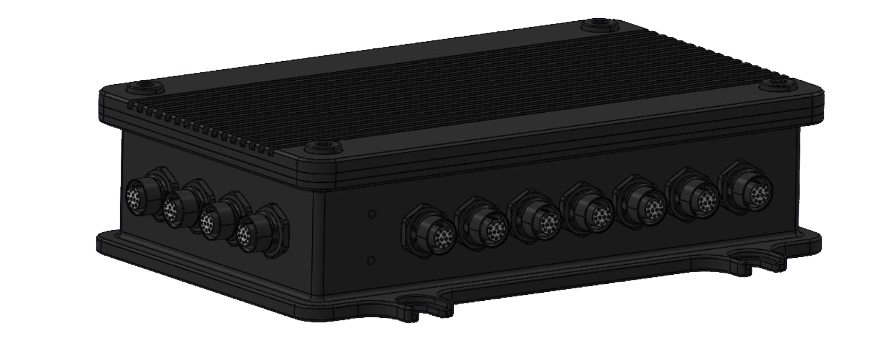

# Donington Overview 

The Donington system offers andvanced capabilities for unmanned systems (PX4 and Ardupilot compatiable autopilot) combined with embedded computer power (Jetson Orin) and dual/redundant Septentrio H and X5 GNSS systems. The system is packaged in a robust aluminum case which has been designed to IP67 standards. The Donington system is based on the EchoMAV [EchoPilot AI](https://echomav.com/product/echopilot-ai/), please refer to the [EchoPilot AI Documentation](https://echomav.github.io/docs/latest/echopilot_ai/) for information specific to that device.

## System Diagram/Flowchart

